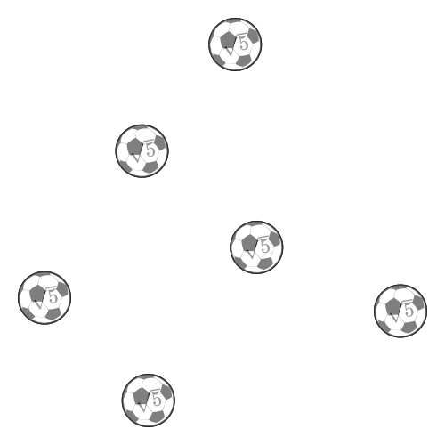

```julia
using JavisGraphs
using LaTeXStrings

function ground(args...)
    background("white")
    sethue("black")
end

demo = Video(500, 500)
Background(1:100, ground)
g = JGraph(true, 400, 400, O, 1:100; layout=:spring)
for i in 1:6
    v = GraphVertex(i, 1:100)
    @add_styles v [vertex_shape(:circle, true; dimensions=(30)), vertex_text_style(fontsize=20), vertex_text(string(L"""\sqrt{5}"""), :inside, angle=10.0), vertex_fill(:image, "./examples/football.png"), vertex_border()]
end
for (i, j) in [(1, 1), (1, 2), (2, 1), (1, 3), (2, 2), (1, 4), (2, 5), (3, 5), (2, 6), (1, 6)]
    e = GraphEdge(i, j, 2:100)
    @add_styles e [edge_style(), edge_shape(:curved), edge_arrow(start=true), edge_text("$i->$j", position=0.6)]
end

render(demo; pathname="demo4.gif")
```

